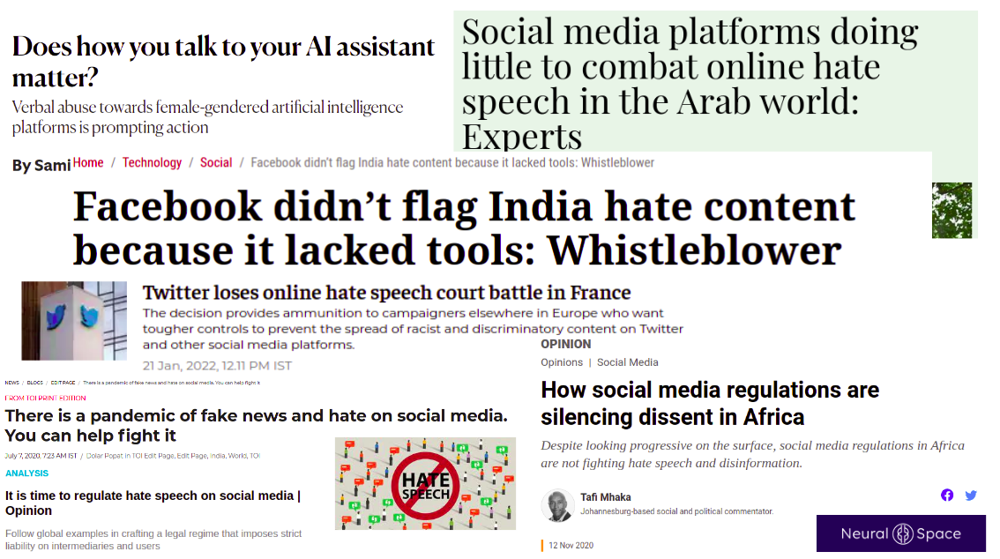
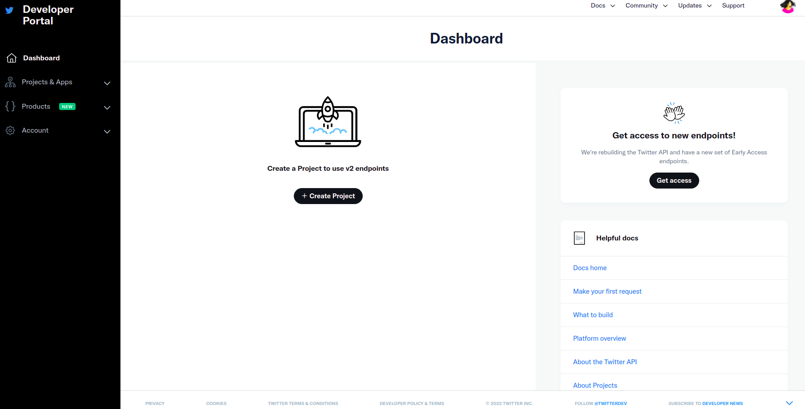
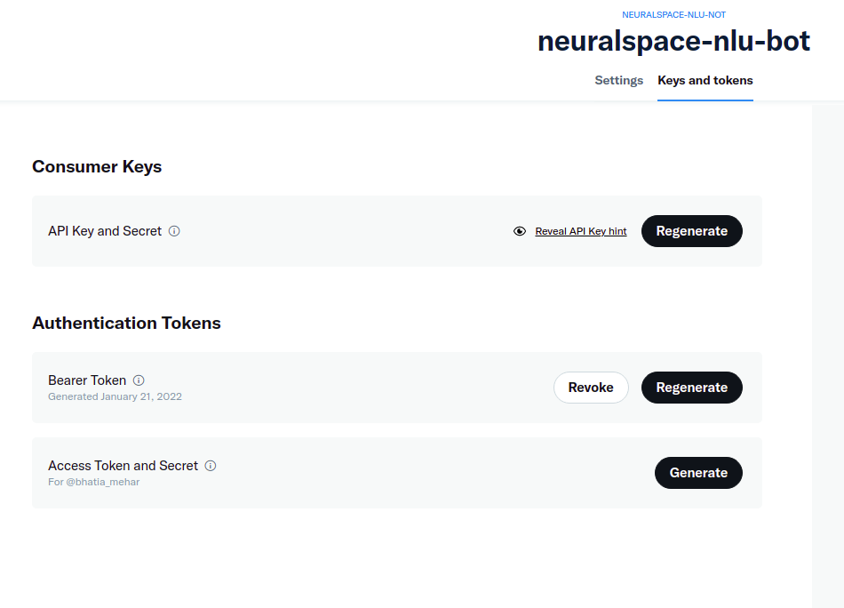
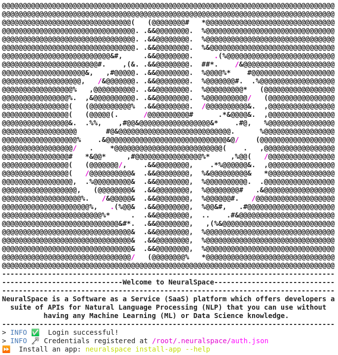

# NeuraLingo-Tutorial-TwitterBot-HateSpeech
This repository contains a tutorial to build a Twitter Bot that classifies hate and offensive tweets using NeuralSpace's NeuraLingo (NLU) API.  

<p align="center">
   
</p>

News Article References:
1. [Indian Express - Facebook didn’t flag India hate content because it lacked tools: Whistleblower](https://indianexpress.com/article/technology/social/facebook-whistleblower-data-scientist-frances-haugen-india-content-7556811/)
2. [Time of India - There is a pandemic of fake news and hate on social media. You can help fight it](https://timesofindia.indiatimes.com/blogs/toi-edit-page/there-is-a-pandemic-of-fake-news-and-hate-on-social-media-you-can-help-fight-it/)
3. [Aljazeera - How social media regulations are silencing dissent in Africa](https://www.aljazeera.com/opinions/2020/11/12/how-social-media-regulations-are-silencing-dissent-in-africa)
4. [Arab News - Social media platforms doing little to combat online hate speech in the Arab world: Experts](https://www.arabnews.com/node/1944116/media)
5. [Hindustan Times - It is time to regulate hate speech on social media](https://www.hindustantimes.com/analysis/it-is-time-to-regulate-hate-speech-on-social-media/story-x2JfnAcZ4mh404CM2wQLpO.html)
6. [The New Stateman - Does how you talk to your AI assistant matter?](https://www.newstatesman.com/spotlight/2021/09/does-how-you-talk-to-your-ai-assistant-matter)
7. [Economic Times - Twitter loses online hate speech court battle in France](https://economictimes.indiatimes.com/tech/technology/twitter-loses-online-hate-speech-court-battle-in-france/articleshow/89034064.cms) 

With a rise in the number of posts made on social media, an increase in the amount of toxic content on the web is witnessed. Measures to detect such instances of toxicity is of paramount importance in today’s world with regards to keeping the web a safe and healthy environment for all. Detecting multilingual hateful and offensive content in typical posts and comments found on the web is the first step towards building a system which can flag items with possible adverse effects and take steps necessary to handle such behavior.

Can NeuralSpace Apps be used as a stepping stone to solve this alarming problem to flag multilingual hatespeech?

Let us get started!

## 1. Train your model using [NeuralSpace NeuraLingo](https://docs.neuralspace.ai/natural-language-understanding/overview).
Let us first train a hatespeech model using NeuralSpace NeuraLingo (Natural Language Understaning) App. To do this, follow our our [Colab repository](https://drive.google.com/file/d/1nMVVnfKmddPQISUr4JKPR71HGLYksab9/view?usp=sharing) to easily build and train your model.

## 2. Install requirements

Wohoo! Once you have your model trained, let us build the Twitter Bot. 

We will need to install some packages. Let us make a conda environment. You can use Python >=3.6.

```
conda create --name neuralspace-nlu-bot python=3.6
conda activate neuralspace-nlu-bot
pip install tweepy==3.10.0
pip install pyyaml
```
As you see, we will use `tweepy`, a package that provides a very convenient way to use the Twitter API. Here is the [documentation](https://tweepy.readthedocs.io/en/latest/api.html). 

## 3. Creating Twitter API Authentication Credentials
The Twitter API requires that all requests use OAuth to authenticate. So you need to create the required authentication credentials to be able to use the API. These credentials are four text strings:

- CONSUMER_KEY
- CONSUMER_SECRET
- ACCESS_TOKEN
- ACCESS_TOKEN_SECRET

If you already have a Twitter user account, then follow these steps to create the key, token, and secrets. Otherwise, you have to sign up as a Twitter user before proceeding.

### Step 1: Apply for a Twitter Developer Account
Go to the [Twitter developer](https://developer.twitter.com/en) site to apply for a developer account. Here, you have to select the Twitter user responsible for this account. It should probably be you or your organization. 

In this case, I chose to use my own account, `@bhatia_mehar`.

Twitter then requests some information about how you plan to use the developer account. You have to specify the developer account name and whether you are planning to use it for personal purpose or for your organization.

### Step 2: Create an Application ✉️
Twitter grants authentication credentials to apps, not accounts. An app can be any tool or bot that uses the Twitter API. So you need to register your an app to be able to make API calls.

To register your app, go to your [Twitter apps page](https://developer.twitter.com/en/portal/projects-and-apps) and select the Create an app option.

<p align="center">
   
</p>

- **App name**: a name to identify your application (such as `neuralspace-nlu-bot`)
- **Application description**: the purpose of your application (such as `An example bot for a NeuralSpace NLU tutorial`)
- **Your or your application’s website URL**: required, but can be your personal site’s URL since bots don’t need a URL to work
- **Use of the app**: how users will use your app (such as `This app is a bot that will automatically classify tweets that are hate and offensive in English, Hindi and Marathi languages`)

### Step 3: Create the Authentication Credentials

To create the authentication credentials, go to your Twitter apps page. Here’s what the Apps page looks like:

Here you’ll find the Dashboard button of your app. Clicking this button takes you to the next page, where you can generate the credentials.

By selecting the Keys and tokens tab, you can generate and copy the key, token, and secrets to use them in your code:
<p align="center">
   
</p>

After generating the credentials, save them in the `config.yaml` file in `src` folder to later use them in your code.

Let us move to the next steps
## 4. Other credentials to pass through config.yaml

To run the twitter bot, there are some other credentials that you must save. 
For NeuralSpace NeuraLingo and Language Detection Authentication, you need the following. 
- MODEL_ID
- ACCESS_TOKEN

The `MODEL_ID` is extracted from the trained HateSpeech model from our Colab Notebook. The `ACCESS_TOKEN` can be extracted in two ways. 

### Extracting access token using CLI
After you login to neuralspace from the CLI using your emailID and password, you will find a link at the bottom where your credentials are saved. In the image below, you can see that the credentials are saved to `/root/.neuralspace/auth.json`. Open that and copy paste to the `config.yaml` file in `src` folder under `neuralspace-lang-detection-auth` and `neuralspace-nlu-auth`. 

<p align="center">
   
</p>

### Extracting access token using Platform
After you login to the Platform, you will find the ACCESS_TOKEN at the top right of the screen beside `Shortcuts` and `API_KEY`. Copy the ACCESS_TOKEN and paste to the `config.yaml` file in `src` folder under `neuralspace-lang-detection-auth` and `neuralspace-nlu-auth`.

Congratulations you have now successfully authenticated your twitter bot and linked NeuralSpace NeuraLingo App to the bot!
<p align="center">
   
</p>

## 6. Features ⭐
Currently, using this Tutorial you can use the following features:
- **Classify the recent n tweets for a specific Twitter user-handle as hate/offensive tweets or not**

    To work with this feature, save the Twitter `USER_HANDLE` and the count of `RECENT_NUM_TWEETS` in the `config.yaml` under `twitter-query` and set `pass-userhandle` as True.
- **Pass a URL of a tweet and classify the recent n comments as hate/offensive or not**

    To work with this feature, save the `TWITTER_URL` and count of `RECENT_NUM_COMMENTS` in the `config.yaml` under `twitter-query` and set `pass-tweet-url` as True.

- **Set precision in Hate-Speech bot**

    As mentioned in the above Colab Notebook, for this Tutorial, we use the dataset from HASOC 2021 Compeition which contains samples in three languages namely, English, Hindi and Marathi. Since this training data is aligned towards tweets related to COVID-19 and related political agenda, our trained model might not be able to classify tweets correctly for other domains. For this reason, it is vital to have a precison-control on our demonstrated Twitter bot to get accurate results. 

    To do this, we extract a threshold for the confidence score using AUC-ROC Curve. In Machine Learning, it is one of the most important evaluation metrics for checking any classification model’s performance.

    If you would like to set precision in your hate-speech bot and calculate the threshold, set `set-precision` under `control-precision` as True in config file and run file `src/roc/ind_optimal_threshold.py`. Then, copy paste the threshold value under `threshold-roc`. To know more about AUC-ROC Curve in Machine Learning, view the README under `src/roc/`

- **Save a report with the results**

    If you would like to save a report with the results from the bot, select `download-report` as True in the config.file and also pass the name you would like to name the file. 

## 7. Run 🏃
Wohoooo! You are now set. To run the bot end-to-end, run the following command:
```
cd src/
python neuralspace_nlu_bot.py
```

## 8. Share on Social Media 👏👏
Wasn't that quick and easy to do! Would you like to share our tutorial this with your network on social media?
- **Share on LinkedIn**: [Click here](https://www.linkedin.com/sharing/share-offsite/?url=https://github.com/Neural-Space/NeuraLingo-Tutorial-TwitterBot-HateSpeech=I%20built%20a%20HateSpeech%20Twitter%20Bot%20using%20NeuralSpace%20Platform&source=Twitter)
- **Share on Twitter**: [Click here](http://twitter.com/share?text=I%20built%20a%20HateSpeech%20Twitter%20Bot%20using%20@NeuralSpace%20Platform.%20It%20was%20so%20easy%20and%20quick.%20Try%20it%20out!&url=https://github.com/Neural-Space/NeuraLingo-Tutorial-TwitterBot-HateSpeech&hashtags=NLProc,NeuralSpace)


👉 Check out our [Documentation](https://docs.neuralspace.ai/) for all the Apps and features of the NeuralSpace Platform.

👉 Join the [NeuralSpace Slack Community](https://neuralspacecommunity.slack.com/join/shared_invite/zt-xlj1xr8k-GQrOkp7tRIV9IuI_0GWS7Q#/shared-invite/email) to receive updates and discuss about NLP for low-resource languages with fellow developers.

👉 Read more about the NeuralSpace Platform on [neuralspace.ai](https://www.neuralspace.ai/).
